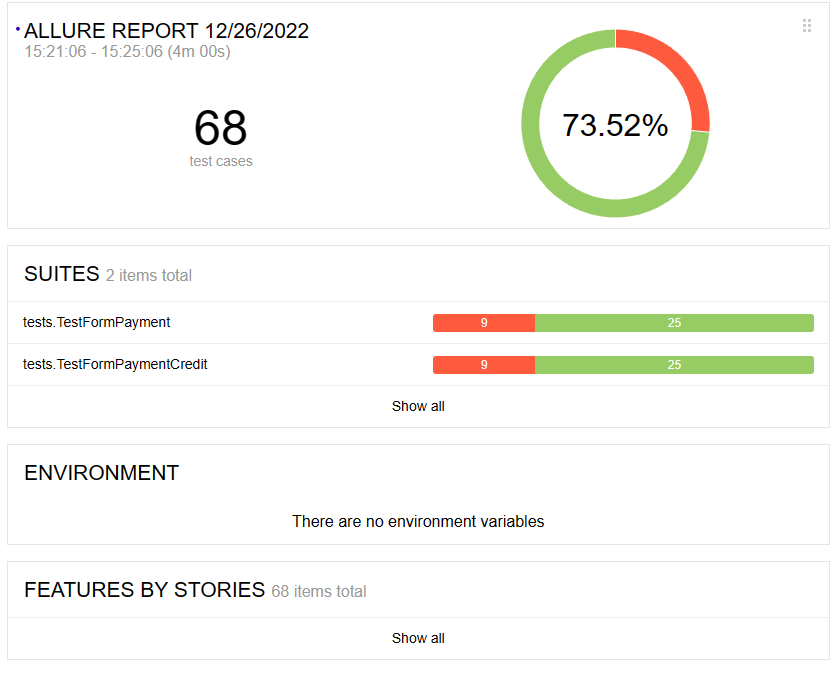
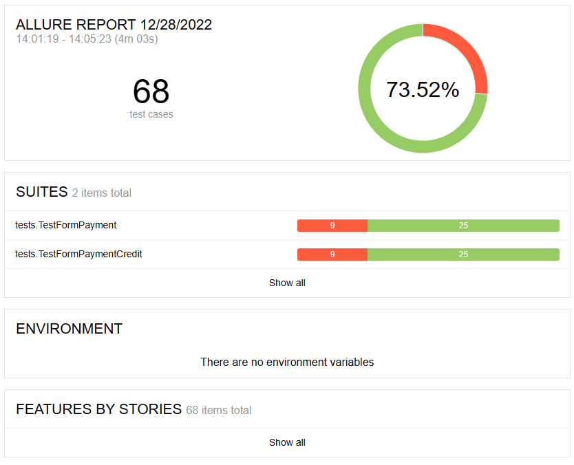

# Отчёт о проведённом тестировании

### Краткое описание

Автоматизировно тестирование комплексного сервиса покупки тура, взаимодействующего с СУБД, согласно [плана автоматизации](https://github.com/century90/diplom_work_qa43/blob/master/Documents/plan.md)

Общее количество тест кейсов: 68

### Статистика успешных/неуспешных кейсов

### *При подключении к БД MySQL:*

- Успешных тестов - 73 % (50 тестов)
- Неуспешных тестов - 27 % (18 тестов)

### *При подключении к БД PostgreSQL:*

- Успешных тестов - 73 % (50 тестов)
- Неуспешных тестов - 27 % (18 тестов)

### Общие рекомендации

Полный список найденных дефектов и рекомендаций на улучшение сервиса находится в [Issues](https://github.com/century90/diplom_work_qa43/issues).